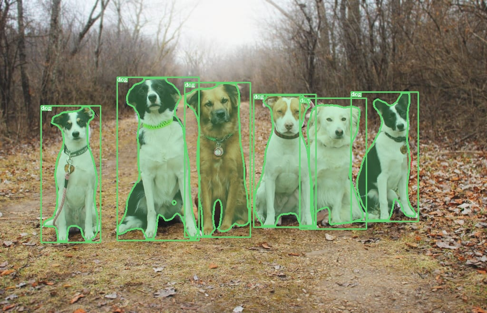
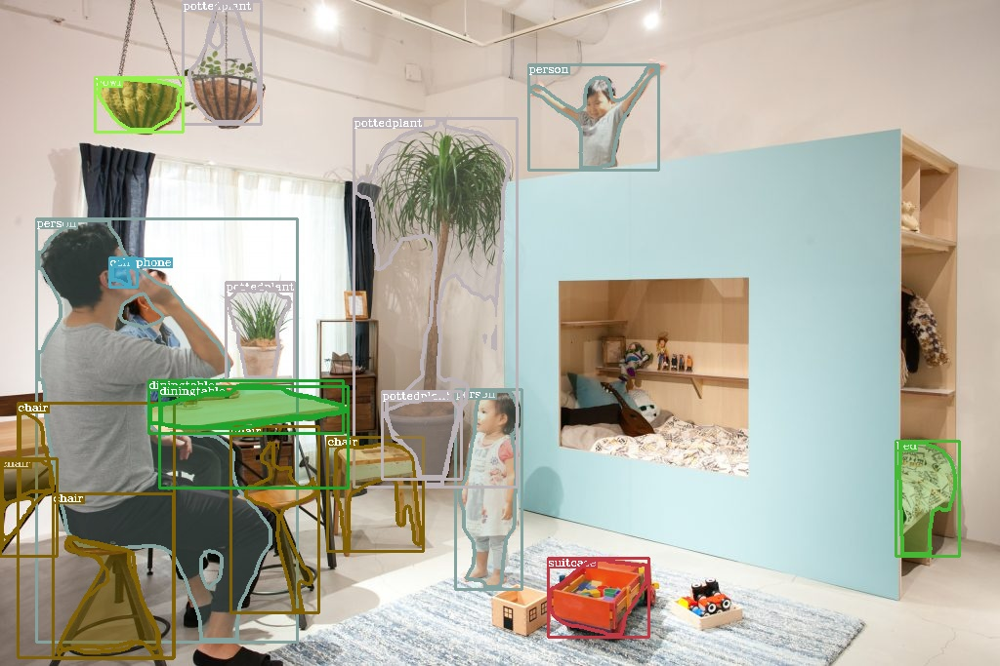
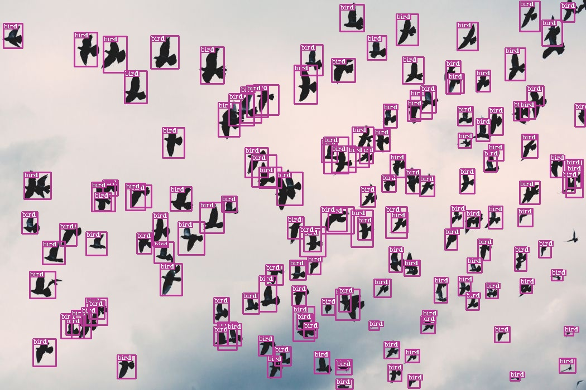

# small c++ library to quickly use [onnxruntime](https://github.com/microsoft/onnxruntime) to deploy deep learning models #

## Installation ##
- build onnxruntime from source with the following script
```bash
    sudo bash ./scripts/install_onnx_runtime.sh
```

## How to build ##
***

```bash
make all

# build apps
make apps
```

## How to test apps ##
***

### Image Classification With Squeezenet ###
***

```bash
# after make apps
./build/examples/TestImageClassification ./data/squeezenet1.1.onnx ./data/images/dog.jpg
```
the following result can be obtained
```
264 : Cardigan, Cardigan Welsh corgi : 0.391365
263 : Pembroke, Pembroke Welsh corgi : 0.376214
227 : kelpie : 0.0314975
158 : toy terrier : 0.0223435
230 : Shetland sheepdog, Shetland sheep dog, Shetland : 0.020529
```

### Object Detection With Tiny-Yolov2 trained on VOC dataset (with 20 classes) ###
***
- Download model from onnx model zoo: [HERE](https://github.com/onnx/models/tree/master/vision/object_detection_segmentation/yolov2)

- The shape of the output would be
```text
    OUTPUT_FEATUREMAP_SIZE X OUTPUT_FEATUREMAP_SIZE * NUM_ANCHORS * (NUM_CLASSES + 4 + 1)
    where OUTPUT_FEATUREMAP_SIZE = 13; NUM_ANCHORS = 5; NUM_CLASSES = 20 for the tiny-yolov2 model from onnx model zoo
```
- Test tiny-yolov2 inference apps
```bash
# after make apps
./build/examples/tiny_yolo_v2 [path/to/tiny_yolov2/onnx/model] ./data/images/dog.jpg
```
- Test result


### Object Instance Segmentation With MaskRCNN trained on MS CoCo Dataset (80 + 1(background) clasess) ###
***
- Download model from onnx model zoo: [HERE](https://github.com/onnx/models/tree/master/vision/object_detection_segmentation/mask-rcnn)

- As also stated in the url above, there are four outputs: boxes(nboxes x 4), labels(nboxes), scores(nboxes), masks(nboxesx1x28x28)
- Test mask-rcnn inference apps
```bash
# after make apps
./build/examples/mask_rcnn [path/to/mask_rcnn/onnx/model] ./data/images/dogs.jpg
```

- Test results:





### Bird Detection With Yolov3 trained on inhouse dataset ###
***

- Details about the my personal repo for training this model will be updated later

- Test results:


