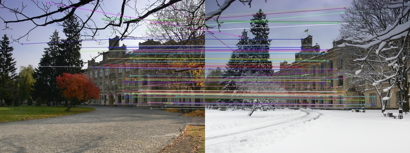

[](https://github.com/xmba15/onnx_runtime_cpp/actions/workflows/build.yml)

If this work somehow makes your day, maybe you can consider :)

[](https://www.buymeacoffee.com/xmba15)

# small c++ library to quickly use [onnxruntime](https://github.com/microsoft/onnxruntime) to deploy deep learning models

Thanks to [cardboardcode](https://github.com/cardboardcode), we have [the documentation](https://onnx-runtime-cpp.readthedocs.io/en/latest/index.html) for this small library.
Hope that they both are helpful for your work.

<details>
  <summary>Table of Contents</summary>
  <ol>
    <li><a href="#todo">TODO</a></li>
    <li><a href="#installation">Installation</a></li>
    <li>
        <a href="#how-to-build">How to Build</a>
        <ul>
            <li><a href="#how-to-run-with-docker">How to Run with Docker</a></li>
        </ul>
    </li>
    <li><a href="#how-to-test-apps">How to test apps</a></li>
  </ol>
</details>

## TODO

- [x] Support inference of multi-inputs, multi-outputs
- [x] Examples for famous models, like yolov3, mask-rcnn, [ultra-light-weight face detector](https://github.com/Linzaer/Ultra-Light-Fast-Generic-Face-Detector-1MB), [yolox](https://github.com/Megvii-BaseDetection/YOLOX), [PaddleSeg](https://github.com/PaddlePaddle/PaddleSeg/tree/release/2.3), [SuperPoint](https://github.com/magicleap/SuperPointPretrainedNetwork), [SuperGlue](https://github.com/magicleap/SuperGluePretrainedNetwork/tree/ddcf11f42e7e0732a0c4607648f9448ea8d73590), [LoFTR](https://zju3dv.github.io/loftr/). Might consider supporting more if requested.
- [x] (Minimal^^) Support for TensorRT backend
- [ ] Batch-inference

## Installation

- build onnxruntime from source with the following script

```bash
    # onnxruntime needs newer cmake version to build
    bash ./scripts/install_latest_cmake.bash


    bash ./scripts/install_onnx_runtime.bash

    # dependencies to build apps
    bash ./scripts/install_apps_dependencies.bash
```

## How to build

---

<details>
<summary>CPU</summary>

```bash
make default

# build examples
make apps
```

</details>

<details>
<summary>GPU with CUDA</summary>

```bash
make gpu_default

make gpu_apps
```

</details>

### How to Run with Docker

<details>
<summary>CPU</summary>

```bash
# build
docker build -f ./dockerfiles/ubuntu2004.dockerfile -t onnx_runtime .

# run
docker run -it --rm -v `pwd`:/workspace onnx_runtime
```

</details>

<details>
<summary>GPU with CUDA</summary>

```bash
# build
# change the cuda version to match your local cuda version before build the docker

docker build -f ./dockerfiles/ubuntu2004_gpu.dockerfile -t onnx_runtime_gpu .

# run
docker run -it --rm --gpus all -v `pwd`:/workspace onnx_runtime_gpu
```

- Onnxruntime will be built with TensorRT support if the environment has TensorRT. Check [this memo](./docs/onnxruntime_tensorrt.md) for useful URLs related to building with TensorRT.
- Be careful to choose TensorRT version compatible with onnxruntime. A good guess can be inferred from [HERE](https://github.com/microsoft/onnxruntime/blob/main/dockerfiles/Dockerfile.tensorrt).
- Also it is not possible to use models whose input shapes are dynamic with TensorRT backend, according to [this](https://onnxruntime.ai/docs/execution-providers/TensorRT-ExecutionProvider.html#shape-inference-for-tensorrt-subgraphs)

</details>

## How to test apps

---

### Image Classification With Squeezenet

---

<details>
<summary>Usage</summary>

```bash
# after make apps
./build/examples/TestImageClassification ./data/squeezenet1.1.onnx ./data/images/dog.jpg
```

the following result can be obtained

```
264 : Cardigan, Cardigan Welsh corgi : 0.391365
263 : Pembroke, Pembroke Welsh corgi : 0.376214
227 : kelpie : 0.0314975
158 : toy terrier : 0.0223435
230 : Shetland sheepdog, Shetland sheep dog, Shetland : 0.020529
```

</details>

<p align="right">(<a href="#readme-top">back to top</a>)</p>

### Object Detection With Tiny-Yolov2 trained on VOC dataset (with 20 classes)

---

<p align="center" width="100%">
    
</p>

<details>
<summary>Usage</summary>

- Download model from onnx model zoo: [HERE](https://github.com/onnx/models/tree/master/vision/object_detection_segmentation/yolov2)

- The shape of the output would be

```text
    OUTPUT_FEATUREMAP_SIZE X OUTPUT_FEATUREMAP_SIZE * NUM_ANCHORS * (NUM_CLASSES + 4 + 1)
    where OUTPUT_FEATUREMAP_SIZE = 13; NUM_ANCHORS = 5; NUM_CLASSES = 20 for the tiny-yolov2 model from onnx model zoo
```

- Test tiny-yolov2 inference apps

```bash
# after make apps
./build/examples/tiny_yolo_v2 [path/to/tiny_yolov2/onnx/model] ./data/images/dog.jpg
```

</details>

<p align="right">(<a href="#readme-top">back to top</a>)</p>

### Object Instance Segmentation With MaskRCNN trained on MS CoCo Dataset (80 + 1(background) clasess)

---

<p align="center" width="100%">
    
    
</p>

<details>
<summary>Usage</summary>

- Download model from onnx model zoo: [HERE](https://github.com/onnx/models/tree/master/vision/object_detection_segmentation/mask-rcnn)

- As also stated in the url above, there are four outputs: boxes(nboxes x 4), labels(nboxes), scores(nboxes), masks(nboxesx1x28x28)
- Test mask-rcnn inference apps

```bash
# after make apps
./build/examples/mask_rcnn [path/to/mask_rcnn/onnx/model] ./data/images/dogs.jpg
```

</details>

<p align="right">(<a href="#readme-top">back to top</a>)</p>

### Yolo V3 trained on Ms CoCo Dataset

---

<p align="center" width="100%">
    
</p>

<details>
<summary>Usage</summary>

- Download model from onnx model zoo: [HERE](https://github.com/onnx/models/tree/master/vision/object_detection_segmentation/yolov3)

- Test yolo-v3 inference apps

```bash
# after make apps
./build/examples/yolov3 [path/to/yolov3/onnx/model] ./data/images/no_way_home.jpg
```

</details>

<p align="right">(<a href="#readme-top">back to top</a>)</p>

### [Ultra-Light-Fast-Generic-Face-Detector-1MB](https://github.com/Linzaer/Ultra-Light-Fast-Generic-Face-Detector-1MB)

---

<p align="center" width="100%">
    
</p>

<details>
<summary>Usage</summary>

- App to use onnx model trained with famous light-weight [Ultra-Light-Fast-Generic-Face-Detector-1MB](https://github.com/Linzaer/Ultra-Light-Fast-Generic-Face-Detector-1MB)
- Sample weight has been saved [./data/version-RFB-640.onnx](./data/version-RFB-640.onnx)
- Test inference apps

```bash
# after make apps
./build/examples/ultra_light_face_detector ./data/version-RFB-640.onnx ./data/images/endgame.jpg
```

</details>

<p align="right">(<a href="#readme-top">back to top</a>)</p>

### [YoloX: high-performance anchor-free YOLO by Megvii](https://github.com/Megvii-BaseDetection/YOLOX)

---

<p align="center" width="100%">
    
</p>

<details>
<summary>Usage</summary>

- Download onnx model trained on COCO dataset from [HERE](https://github.com/Megvii-BaseDetection/YOLOX/tree/main/demo/ONNXRuntime)

```bash
# this app tests yolox_l model but you can try with other yolox models also.
wget https://github.com/Megvii-BaseDetection/YOLOX/releases/download/0.1.1rc0/yolox_l.onnx -O ./data/yolox_l.onnx
```

- Test inference apps

```bash
# after make apps
./build/examples/yolox ./data/yolox_l.onnx ./data/images/matrix.jpg
```

</details>

<p align="right">(<a href="#readme-top">back to top</a>)</p>

### [Semantic Segmentation Paddle Seg](https://github.com/PaddlePaddle/PaddleSeg)

---

<p align="center" width="100%">
    
</p>

<p align="center" width="100%">
    
    
</p>

<details>
<summary>Usage</summary>

- Download PaddleSeg's bisenetv2 trained on cityscapes dataset that has been converted to onnx [HERE](https://drive.google.com/file/d/1e-anuWG_ppDXmoy0sQ0sgrdutCTGlk95/view?usp=sharing) and copy to [./data directory](./data)

<details>
<summary>You can also convert your own PaddleSeg with following procedures</summary>

- [export PaddleSeg model](https://github.com/PaddlePaddle/PaddleSeg/blob/release/2.3/docs/model_export.md)
- convert exported model to onnx format with [Paddle2ONNX](https://github.com/PaddlePaddle/Paddle2ONNX)

</details>

- Test inference apps

```bash
./build/examples/semantic_segmentation_paddleseg_bisenetv2 ./data/bisenetv2_cityscapes.onnx ./data/images/sample_city_scapes.png
./build/examples/semantic_segmentation_paddleseg_bisenetv2 ./data/bisenetv2_cityscapes.onnx ./data/images/odaiba.jpg
```

</details>

<p align="right">(<a href="#readme-top">back to top</a>)</p>

### [SuperPoint](https://arxiv.org/pdf/1712.07629.pdf)

---

<p align="center" width="100%">
    
</p>

<details>
<summary>Usage</summary>

- Convert SuperPoint's pretrained weights to onnx format

```bash
git submodule update --init --recursive
python3 -m pip install -r scripts/superpoint/requirements.txt
python3 scripts/superpoint/convert_to_onnx.py
```

- Download test images from [this dataset](https://github.com/StaRainJ/Multi-modality-image-matching-database-metrics-methods)

```bash
wget https://raw.githubusercontent.com/StaRainJ/Multi-modality-image-matching-database-metrics-methods/master/Multimodal_Image_Matching_Datasets/ComputerVision/CrossSeason/VisionCS_0a.png -P data

wget https://raw.githubusercontent.com/StaRainJ/Multi-modality-image-matching-database-metrics-methods/master/Multimodal_Image_Matching_Datasets/ComputerVision/CrossSeason/VisionCS_0b.png -P data
```

- Test inference apps

```bash
./build/examples/super_point /path/to/super_point.onnx data/VisionCS_0a.png data/VisionCS_0b.png
```

</details>

<p align="right">(<a href="#readme-top">back to top</a>)</p>

### [SuperGlue](https://arxiv.org/pdf/1911.11763.pdf)

---

<p align="center" width="100%">
    
    
</p>

<p align="center" width="100%">
    
    
</p>

<p align="center" width="100%">
    
    
</p>

<details>
<summary>Usage</summary>

- Convert SuperPoint's pretrained weights to onnx format: Follow the above instruction

- Convert SuperGlue's pretrained weights to onnx format

```bash
git submodule update --init --recursive
python3 -m pip install -r scripts/superglue/requirements.txt
python3 -m pip install -r scripts/superglue/SuperGluePretrainedNetwork/requirements.txt
python3 scripts/superglue/convert_to_onnx.py
```

- Download test images from [this dataset](https://github.com/StaRainJ/Multi-modality-image-matching-database-metrics-methods): Or prepare some pairs of your own images

- Test inference apps

```bash
./build/examples/super_glue /path/to/super_point.onnx /path/to/super_glue.onnx /path/to/1st/image /path/to/2nd/image
```

</details>

<p align="right">(<a href="#readme-top">back to top</a>)</p>

### [LoFTR](https://zju3dv.github.io/loftr/)

---

<p align="center" width="100%">
    
</p>

<details>
<summary>Usage</summary>

- Download [LoFTR](https://github.com/zju3dv/LoFTR) weights indoor*ds_new.ckpt from [HERE](https://drive.google.com/drive/folders/1xu2Pq6mZT5hmFgiYMBT9Zt8h1yO-3SIp). (LoFTR's [latest commit](b4ee7eb0359d0062e794c99f73e27639d7c7ac9f) seems to be only compatible with the new weights (Ref: https://github.com/zju3dv/LoFTR/issues/48). Hence, this onnx cpp application is only compatible with \_indoor_ds_new.ckpt* weights)

- Convert LoFTR's pretrained weights to onnx format

```bash
git submodule update --init --recursive
python3 -m pip install -r scripts/loftr/requirements.txt
python3 scripts/loftr/convert_to_onnx.py --model_path /path/to/indoor_ds_new.ckpt
```

- Download test images from [this dataset](https://github.com/StaRainJ/Multi-modality-image-matching-database-metrics-methods): Or prepare some pairs of your own images

- Test inference apps

```bash
./build/examples/loftr /path/to/loftr.onnx /path/to/loftr.onnx /path/to/1st/image /path/to/2nd/image
```

</details>

<p align="right">(<a href="#readme-top">back to top</a>)</p>
